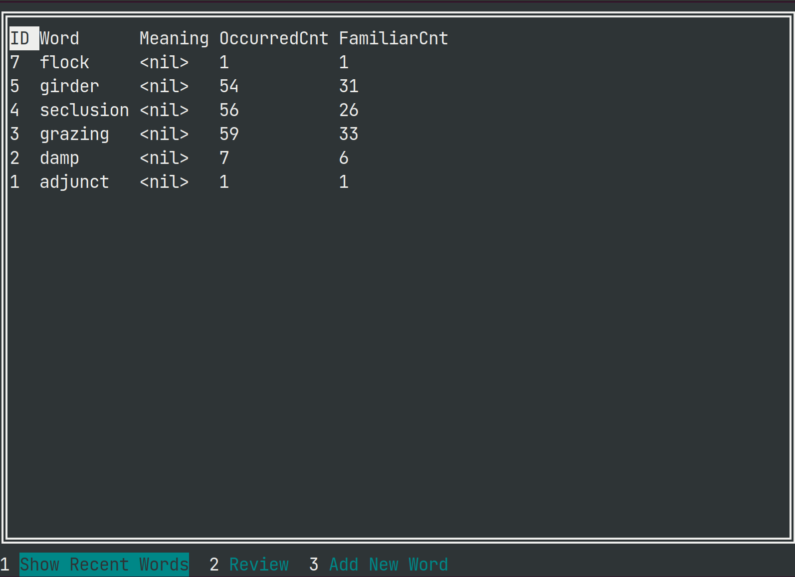

# Vocabulary Record
It is a self-used tool with terminal user interface to help recite unfamiliar English words.

*Everything is still under construction yet. A website version is also in consideration.*

## Features
It contains three modes so far, which can be switched by pressing the number button indicated at the bottom of the screen
1. Show recent added words
2. Review unfamiliar words
3. Add new word

When selecting a word, pressing `Enter` will open a `YouDao` Dictionary query in the default browser (only worked for linux).

Of course, these features are not adequate to provide a smooth experience, so a combination of database and this TUI tool is a welcomed choice.

## Database
So far `sqlite` is used as the backbone to store data (e.g. words, occurred counts) persistently.
`sqlite` is a lightweight database without the need to host a server since all data is stored within a single file, so it becomes a good choice for building a simple local app.

The location of the database is hardcoded now (so other users cannot successfully run the app without minor modification to the code), which may be resolved later.

## Terminal User Interface
I leverage the power of a golang library [`tview`](github.com/rivo/tview) to build this app.